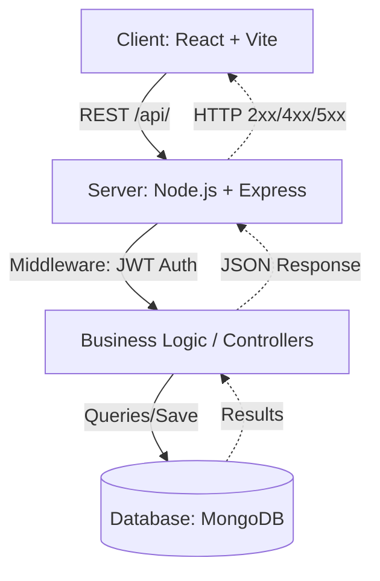
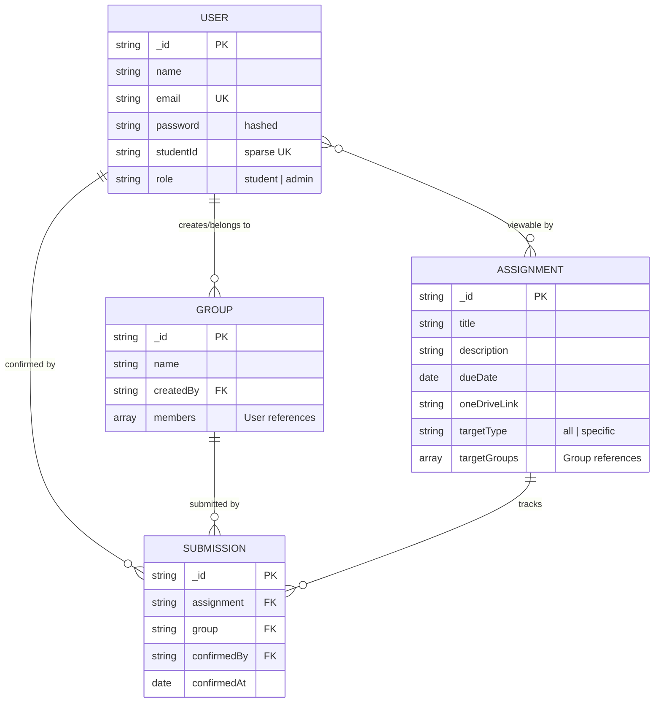

# Joineazy Task: Student, Group & Assignment Management System

A role-based full-stack application for managing student groups and assignment tracking. Designed for seamless collaboration between students and professors.

---

## 🚀 Overview of Implementation

This project implements a **Student-Professor Collaboration Portal** with the following core functionalities:

-   **Student Features**:
    -   **Authentication & Registration**: Students register and log in with email or student ID.
    -   **Group Management**: Students can create groups and invite members (via email or student ID). Only one group per student is permitted.
    -   **Assignment Tracking**: View all relevant assignments (targeted to their group or "all").
    -   **Submission Workflow**: A two-step submission process (acknowledge → confirm) for OneDrive links.
    -   **Progress Visualization**: Real-time progress bar reflecting group-wide confirmation status.
-   **Admin (Professor) Features**:
    -   **Assignment Management**: Create, edit, and target assignments to specific groups or all students.
    -   **Dashboard & Analytics**: Real-time overview of group-wise and student-wise submissions.
    -   **Completion Metrics**: Tracking counts and percentage-based completion rates across all assignments.

### 🛠 Tech Stack
-   **Frontend**: React 19, TypeScript, Vite, Tailwind CSS, Lucide React, Framer Motion.
-   **Backend**: Node.js, Express, Mongoose, JWT (Stateless Auth).
-   **Database**: MongoDB (Atlas for production, Local for dev).
-   **Containerization**: Docker & Docker Compose.

---

## ⚙️ Setup & Run Instructions

### 📋 Prerequisites
-   **Node.js** (v20+ recommended)
-   **npm / yarn**
-   **MongoDB** (running locally or a cloud URI)
-   **Docker Desktop** (optional, for Dockerized deployment)

### 🔑 Environment Configuration

Create a `.env` file in both `backend` and `frontend` directories based on the provided `.env.example` files.

#### **Backend (`backend/.env`)**
```env
PORT=5000
MONGO_URI=mongodb://localhost:27017/joinezy
JWT_SECRET=your_jwt_secret_key
ADMIN_NAME=Admin User
ADMIN_EMAIL=admin@joineazy.com
ADMIN_PASSWORD=admin123
```

#### **Frontend (`frontend/.env`)**
```env
VITE_API_URL=http://localhost:5000
```

### 🏃 Running Locally

#### **Option 1: Manual Run (Two Terminals)**

1.  **Backend**:
    ```bash
    cd backend
    npm install
    npm run dev
    ```
2.  **Frontend**:
    ```bash
    cd frontend
    npm install
    npm run dev
    ```
    -   The app will be available at `http://localhost:5173`.

#### **Option 2: Docker Compose (Single Command)**
From the root directory:
```bash
docker compose up --build
```
-   Frontend: `http://localhost:5173`
-   Backend: `http://localhost:5000`

---

## 📡 API Endpoint Details

All authenticated routes require `Authorization: Bearer <TOKEN>`.

### 🔐 Authentication
| Method | Path | Access | Description |
| :--- | :--- | :--- | :--- |
| `POST` | `/api/auth/register` | Public | Register new user. Fields: `name`, `email`, `password`, `studentId`, `role`. |
| `POST` | `/api/auth/login` | Public | Login with `email` & `password`. Returns JWT token. |
| `GET` | `/api/auth/me` | Authenticated | Fetch current user profile. |

### 👥 User & Group Management
| Method | Path | Access | Description |
| :--- | :--- | :--- | :--- |
| `GET` | `/api/users/students` | Authenticated | List all registered students (minimal fields). |
| `POST` | `/api/groups` | Student | Create a new group. The creator becomes a member. |
| `GET` | `/api/groups/my` | Student | Fetch current user's group and members. |
| `POST` | `/api/groups/:id/members`| Student | Invite a student to a group by `email` or `studentId`. |
| `GET` | `/api/groups` | Admin | List all groups and their members. |

### 📝 Assignments
| Method | Path | Access | Description |
| :--- | :--- | :--- | :--- |
| `POST` | `/api/assignments` | Admin | Create assignment. Fields: `title`, `description`, `dueDate`, `oneDriveLink`, `targetType`. |
| `GET` | `/api/assignments` | Authenticated | Students see targeted assignments; Admins see all. |
| `PUT` | `/api/assignments/:id`| Admin | Update an existing assignment. |

### ✅ Submissions & Analytics
| Method | Path | Access | Description |
| :--- | :--- | :--- | :--- |
| `POST` | `/api/submissions/confirm/:id` | Student | Confirm submission for an assignment by group. |
| `GET` | `/api/submissions/my-group` | Student | List assignments already confirmed by the group. |
| `GET` | `/api/analytics/admin-summary` | Admin | Comprehensive analytics: student counts, group counts, completion rates. |

---

## 🏗 Architecture Overview

The system follows a modern decoupled architecture ensuring scalability and maintainability.

### 🔄 Data Flow (Frontend → Backend → DB)

1.  **Client Tier**: The React frontend (Vite) manages state and handles user interactions. It communicates with the backend via REST API using `axios`.
2.  **Logic Tier**: The Express server acts as the central hub. It uses JWT middleware for session-less authentication and Mongoose models for data validation.
3.  **Data Tier**: MongoDB (NoSQL) stores unstructured data, allowing for flexible student-group mapping.



### 🛰 System Interaction Flow

-   **Student Flow**: Login → Join/Create Group → View Assignments → Confirm Submissions.
-   **Admin Flow**: Login → Management Dashboard → Create/Target Assignments → View Real-time Analytics.

---

## 📊 Database Schema & Relationships

The project uses MongoDB with optimized indexing for performance.

### 📐 Entity-Relationship Diagram (ERD)



---

## 💡 Key Design and Deployment Decisions

| Decision | Rationale |
| :--- | :--- |
| **MERN Stack** | Chosen for its unified JavaScript environment, rich package ecosystem (Vite, Mongoose), and speed of development. |
| **JWT Authentication** | Implemented for stateless session management, which is ideal for SPAs and simplifies API-first designs. |
| **Atomic Submissions** | Each group confirms an assignment only once. Using a compound unique index `(assignment, group)` prevents duplicate records while tracking the specific student who clicked "Confirm". |
| **Targeted Assignments** | Logic implemented to filter assignments on the server-side, ensuring students only see work relevant to them (Privacy & Focus). |
| **Dockerization** | Provides a consistent environment across development, testing, and production, simplifying the "it works on my machine" problem. |
| **Static + API Deployment** | Recommendation: Deploy frontend to Vercel/Netlify for fast CDN delivery and backend to Render/Railway for managed Node.js hosting. |

---

## 📂 Project Structure

```text
joinezy task/
├── backend/            # Express Application
│   ├── src/
│   │   ├── models/     # database schemas
│   │   ├── routes/     # API endpoints
│   │   └── server.js   # Main entry point
│   └── scripts/        # Testing & automation
├── frontend/           # React Application
│   ├── src/
│   │   ├── ui/         # Components & core UI
│   │   └── main.tsx    # App initialization
├── docker-compose.yml  # Containerization orchestration
└── README.md           # Documentation
```
